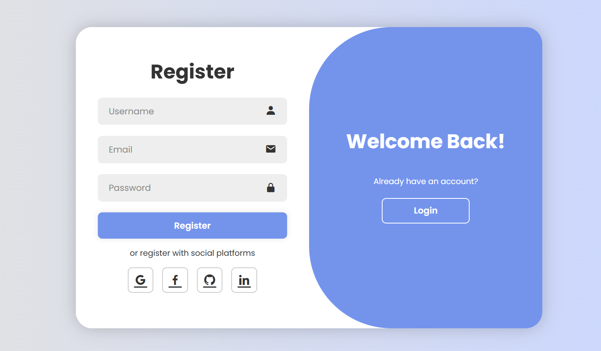
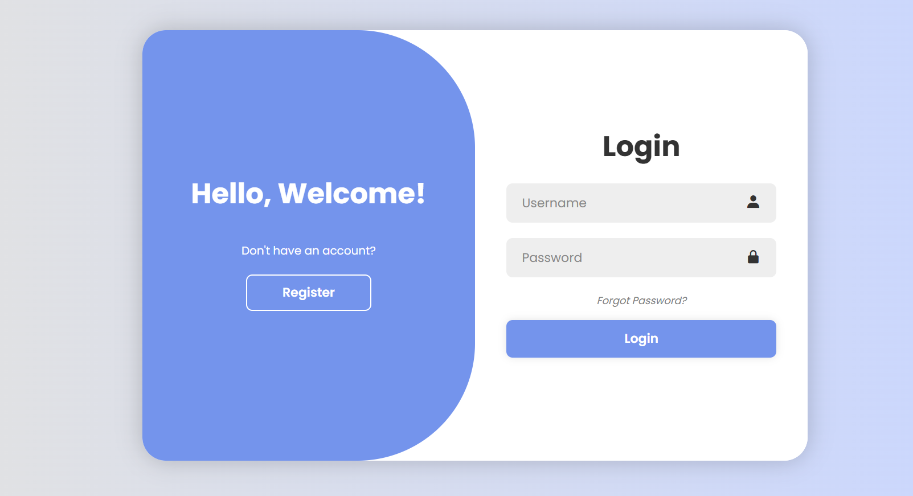

## 🔐 Login Authentication System

A secure, responsive, and interactive Login & Registration Web App built using HTML, CSS, and JavaScript.
It allows users to register, login, and logout, with credentials stored in LocalStorage for simulation of real authentication.

---

## 🚀 Live Demo

🔗 [Try it here](https://kunal-web3.github.io/Login-Authentication/) 

---

## 🛠️ Tech Stack

HTML5 – structure  
CSS3 – modern UI design & responsiveness  
JavaScript (ES6) – authentication logic & interactivity  

---

## 📂 Project Structure

📌 OIBSIP-LoginAuth/

├── index.html # Login & Registration UI  
├── style.css # Styling (forms, messages, responsiveness)  
├── script.js # Authentication logic (register, login, logout)  
├── welcome.html # Redirect page after successful login  
├── screenshot.png # Project preview  
└── README.md # Project documentation  

---

## 📸 Preview :

📝 Registration & Login Forms

  

 

---

## ✨ Features

✅ User Registration with validation  
✅ Direct Auto-Redirect to Login after Registration  
✅ Login Authentication using LocalStorage  
✅ Forgot Password & Reset Password functionality  
✅ Dynamic Success & Error Messages (without alerts)  
✅ Auto-Redirect to Welcome Page after Login  
✅ Logout functionality for session handling  
✅ Fully Responsive across all devices  
✅ Modern UI with smooth form transitions  

---

## 🎯 Learning Outcomes

Through this project, I learned:  

📌 Implementing form validation & authentication logic in JavaScript  
📌 Handling LocalStorage for storing and updating user data  
📌 Creating dynamic message boxes for better UI feedback  
📌 Implementing Forgot Password & Reset Password features  
📌 Designing responsive forms with CSS Flexbox & Grid  

---

## 🙌 Acknowledgement

Special thanks to Oasis Infobyte (OIBSIP) for the opportunity and guidance.

---

## 📢 Connect with Me  

🔗 [LinkedIn](https://www.linkedin.com/in/kunal-jadhav-kj) | 🌐 [GitHub](https://github.com/kunal-web3)

